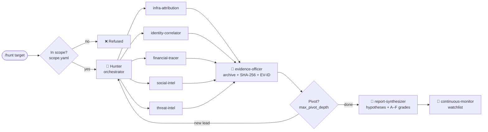

<div align="center">

# 🎯 The Hunter

**An OSINT investigation agent for Claude Code. It stays inside a scope you define and keeps chain-of-custody evidence for every finding.**

Give it a domain, IP, email, phone number, social handle, crypto wallet or image.
It returns an attribution dossier you can hand to a lawyer, a payment processor or the police.

[](https://github.com/drtamar/The-hunter/actions/workflows/ci.yml)
[](https://www.python.org/downloads/)
[](LICENSE)
[](https://github.com/psf/black)
[](https://docs.claude.com/en/docs/claude-code)

[Quick start](#-quick-start) •
[How it works](#-how-it-works) •
[Commands](#-slash-commands) •
[Safety model](#-safety-model) •
[Python library](#-python-library--cli) •
[FAQ](#-faq)

</div>

---

## ✨ Why The Hunter?

Most OSINT tools stop once they've collected data. The Hunter also covers what comes after: evidence that holds up, conclusions you can defend, and a paper trail that protects **you**, the investigator.

| | |
|---|---|
| 🧭 **Scope first** | Nothing active runs until you declare what's in scope. Out-of-scope targets are refused. |
| 🧾 **Evidence is the product** | Every fetch is archived (Wayback Machine + archive.today + a local SHA-256 capture) and assigned an `EV-0001`-style ID. A claim without an evidence ID doesn't make it into the report. |
| 🧠 **Tracks hypotheses** | Each claim is marked Confirmed, Indeterminate or Refuted, based on the evidence for and against it (the Heuer ACH method). |
| 🅰️ **Grades sources** | Every source gets an A–F reliability grade. Only grade-A claims are stated as fact. |
| 🛡️ **Protects you** | Your own name, email, IP and bank details are removed from every output. |
| ⚡ **Parallel specialists** | An orchestrator splits the job across 8 specialist subagents that work at the same time. |
| 🔔 **Keeps watching** | Add a target to a watchlist and get alerted when a scam domain or wallet reappears. |

**Built for legitimate work:** scam victims seeking attribution, authorized pentests, CTFs, journalism, threat intelligence and academic OSINT research.

---

## 🚀 Quick start

### 1. Prerequisites

- [Claude Code](https://docs.claude.com/en/docs/claude-code)
- Python **3.10+**
- [`uv`](https://docs.astral.sh/uv/), used to launch two of the MCP backends
- `git` and `jq` (the guardrail hooks use `jq`)

### 2. Clone and install

```bash
git clone https://github.com/drtamar/The-hunter.git
cd The-hunter

python -m venv .venv && source .venv/bin/activate   # Windows: .venv\Scripts\activate
pip install -r requirements.txt -r requirements-hunter.txt
```

### 3. (Optional) Add the intelligence backends

The Hunter calls three MCP servers, configured in [`.mcp.json`](.mcp.json). It expects each one to be cloned **next to** this repo:

```bash
cd ..
git clone https://github.com/drtamar/world-intel-mcp          # 110 intel tools, sanctions, GDELT, KEV…
git clone https://github.com/drtamar/shodan-mcp               # Shodan / InternetDB / CVE lookups
git clone https://github.com/drtamar/pentest-osint-mcp-server # Sherlock, Maigret, Holehe, subfinder, dnstwist…
cd The-hunter
```

Then export whichever API keys you have. Every key is optional; tools whose key is missing are skipped.

```bash
export SHODAN_API_KEY=...        # shodan
export VIRUSTOTAL_API_KEY=...    # pentest-osint
export HIBP_API_KEY=...          # pentest-osint (breach lookups)
export HUNTERIO_API_KEY=...      # pentest-osint (email discovery)
export GREYNOISE_API_KEY=...     # pentest-osint
export INTELX_API_KEY=...        # pentest-osint
export OPENAI_API_KEY=...        # world-intel (vector search)
```

> 💡 No backends yet? The Hunter still works in passive mode with Claude Code's built-in web tools. You just get fewer data sources.

### 4. Declare your scope

```bash
cp scope/scope.template.yaml scope/scope.yaml
```

Open `scope/scope.yaml` and fill in:

- **`authorization`**: why you're allowed to investigate (for example, *"victim of a crypto scam"* or *"pentest engagement ACME-2026-Q2"*)
- **`targets`**: the domains, IPs, handles, emails, phones and wallets you may investigate
- **`victim_pii`**: **your own** details, which will be scrubbed from every output
- **`opsec`**: what the agent may do. Active scanning and credential checks are **off** by default.

### 5. Launch and hunt

```bash
claude --plugin-dir .
```

Then, inside Claude Code:

```text
/scope show                      # check that the scope parsed correctly
/hunt scammer-domain.com         # run a full investigation
```

That's it. 🎉 Each case gets its own folder under `case/<CASE-ID>/`, which holds the evidence ledger, the archived captures, the audit log and the reports.

---

## 🧩 How it works



1. **Scope check.** The target must be listed in `scope/scope.yaml`.
2. **Open a case.** A `CASE-YYYY-NNNN` ID and workspace folder are created.
3. **Delegate in parallel.** Only the subagents relevant to the target type run. For example, a domain doesn't need the financial tracer.
4. **Capture evidence.** Every finding is archived, hashed and given an EV-ID.
5. **Pivot.** New leads are followed automatically, such as registrar email → reverse WHOIS → sister domains, up to your configured depth.
6. **Synthesize.** The result is a dossier that tracks each hypothesis and grades each source. For scam cases it ends with a **handover section for law enforcement, payment processors or counsel**.
7. **Watch.** Optionally, keep monitoring the target and get alerted if it comes back.

### 🕵️ The specialist subagents

| Subagent | Handles |
|---|---|
| `infra-attribution` | Domains, IPs, SSL certificates, registrars, ASNs, hosting fingerprints |
| `identity-correlator` | Emails, phone numbers, handles, breach correlation across platforms |
| `financial-tracer` | Crypto wallets, exchanges, payment processors, sanctions lists |
| `social-intel` | Telegram, X, Instagram, Facebook, TikTok, Discord, Reddit, LinkedIn |
| `evidence-officer` | Chain-of-custody capture, SHA-256 hashing, EV-ID issuance |
| `threat-intel` | IOC enrichment, scam-domain databases, CTI feeds |
| `continuous-monitor` | Watchlists, alerting, detecting when a target reappears |
| `report-synthesizer` | Hypothesis tracking and the final dossier |

Their definitions are in [`agents/`](agents/).

---

## 💻 Slash commands

| Command | What it does |
|---|---|
| `/scope set` · `/scope show` · `/scope lock` | Declare, inspect or freeze the engagement scope |
| `/hunt <target>` | Full investigation. The target can be a domain, IP, email, phone, handle, wallet or image path |
| `/trace wallet\|domain\|email\|handle <value>` | A targeted trace along one line of inquiry |
| `/archive <url>` | Capture a page for chain of custody (Wayback + archive.today + SHA-256) |
| `/pivot from-finding <EV-ID>` | Expand from one finding to related ones |
| `/ev log\|list\|verify` | Manage and integrity-check the evidence ledger |
| `/monitor add\|list\|alerts` | Manage the continuous watchlist |
| `/report interim\|final` | Generate the dossier |

**Example session**

```text
/hunt fake-shop.io
/trace wallet 0x9f2c…e41a
/pivot from-finding EV-0007
/monitor add domain fake-shop-2.io
/report final
```

---

## 🔒 Safety model

The Hunter is designed so the careful path is the default.

| Guardrail | Default | Configured in `scope.yaml` |
|---|---|---|
| Refuse targets that aren't in scope | ✅ always on | `targets`, `out_of_scope` |
| Active scanning (nmap, dirbusting, nuclei, sqlmap) | ⛔ off | `opsec.allow_active_scanning` |
| Credential and breach checks (h8mail, holehe) | ⛔ off | `opsec.allow_credential_checks` |
| Paid APIs (Shodan, VirusTotal, IntelX) | ✅ on | `opsec.allow_paid_apis` |
| Maximum pivot hops | 3 | `opsec.max_pivot_depth` |
| Time budget per `/hunt` | 60 min | `opsec.max_runtime_minutes` |
| Remove your own details from outputs | ✅ on | `victim_pii`, `reporting.redact_investigator` |

### 🪝 Enabling the guardrail hooks

Three hook scripts in [`hooks/`](hooks/) enforce these rules on every tool call. Register them once in `.claude/settings.json` in this repo:

```json
{
  "hooks": {
    "PreToolUse": [
      { "matcher": "*", "hooks": [{ "type": "command", "command": "bash \"$CLAUDE_PROJECT_DIR\"/hooks/opsec-gate.sh" }] }
    ],
    "PostToolUse": [
      { "matcher": "*", "hooks": [{ "type": "command", "command": "bash \"$CLAUDE_PROJECT_DIR\"/hooks/audit-log.sh" }] },
      { "matcher": "*", "hooks": [{ "type": "command", "command": "bash \"$CLAUDE_PROJECT_DIR\"/hooks/evidence-capture.sh" }] }
    ]
  }
}
```

| Hook | When it runs | Job |
|---|---|---|
| `opsec-gate.sh` | Before every tool call | Blocks out-of-scope targets and disallowed tools, and warns if there's no scope file |
| `audit-log.sh` | After every tool call | Appends to the append-only log `case/<CASE-ID>/audit.jsonl` |
| `evidence-capture.sh` | After web fetches (WebFetch, MCP HTTP tools, `curl`/`wget`) | Archives the page, hashes it and issues an EV-ID |

---

## 🐍 Python library & CLI

All of the case, evidence and monitoring logic is in [`hunter_lib/`](hunter_lib/), a mostly standard-library Python package. You can use it without Claude.

```bash
python -m hunter_lib.cli case open --target example.com     # → CASE-2026-0001
python -m hunter_lib.cli case list
python -m hunter_lib.cli archive url --case CASE-2026-0001 --url https://example.com
python -m hunter_lib.cli evidence list   --case CASE-2026-0001
python -m hunter_lib.cli evidence verify --case CASE-2026-0001   # re-hash and detect tampering
python -m hunter_lib.cli monitor add --case CASE-2026-0001 --kind domain --value example.com --interval 60
python -m hunter_lib.cli monitor alerts --days 7
```

| Module | Purpose |
|---|---|
| `case_db` | Case lifecycle and the findings database (SQLite) |
| `evidence_log` | Append-only EV-ID ledger, with supersede and contradict markers |
| `archiver` | Wayback + archive.today + local capture + SHA-256 |
| `hypothesis_tracker` | Confirmed / Indeterminate / Refuted, weighted by source grade |
| `source_grader` | A–F reliability grades for each source type |
| `alias_graph` | Graph of linked identities, exportable to Mermaid |
| `watchlist` · `notifier` | Continuous monitoring, plus Telegram, Discord and Slack alerts |
| `opsec` · `pii_redactor` | Scope enforcement and removal of your details |

### Framework layer

The Hunter is built on **AI-OSINT-Framework**, a Python toolkit that includes:

- `modules/technical/`: WHOIS and DNS lookups
- `ai_tools/`: Claude and OpenAI analyzers
- `legal/`: GDPR and CCPA helpers
- `core/`: engine, validators, rate limiter

```bash
python examples/basic_lookup.py            # WHOIS lookup
python examples/claude_analysis_example.py # needs ANTHROPIC_API_KEY
```

Copy `config/config.example.yml` to `config/config.yml` to configure AI providers. The Claude analyzer uses `claude-sonnet-5` by default.

---

## 📁 Project layout

```text
The-hunter/
├── CLAUDE.md              # Root persona and operating rules for the orchestrator
├── .claude-plugin/        # Claude Code plugin manifest
├── .mcp.json              # MCP backends: world-intel, shodan, pentest-osint
├── agents/                # 8 specialist subagents
├── commands/              # 8 slash commands
├── skills/                # 10 skills (dorking, crypto-tracing, chain-of-custody, …)
├── hooks/                 # opsec gate, audit log, evidence capture
├── scope/                 # scope.template.yaml → copy to scope.yaml
├── hunter_lib/            # Python case, evidence and monitoring library + CLI
├── core/ modules/ ai_tools/ legal/   # AI-OSINT-Framework base
├── documentation/         # OSINT playbooks, tool families, ethics, report templates
├── examples/              # Runnable framework examples
└── tests/                 # pytest suite + Hunter smoke tests
```

---

## 🛠️ Development

```bash
pip install -r requirements-dev.txt

make test        # pytest with coverage
make lint        # flake8 + mypy
make format      # black + isort
make security    # bandit + pip-audit
python -m unittest tests.hunter_smoke   # Hunter smoke tests
```

CI runs tests on Python 3.10–3.12, plus lint, type checks, security scans and a package build. Contributions are welcome. See [CONTRIBUTING.md](CONTRIBUTING.md).

---

## ❓ FAQ

<details>
<summary><b>Do I need all the API keys?</b></summary>

No, they're all optional. Without keys, The Hunter falls back to free and passive sources such as RDAP/WHOIS, crt.sh, public blockchain explorers and web archives. Keys add coverage and depth.
</details>

<details>
<summary><b>Why was my <code>/hunt</code> refused?</b></summary>

The target isn't listed under `targets` in `scope/scope.yaml`, or it's listed under `out_of_scope`. Add it to `targets`, then run `/scope show` to confirm.
</details>

<details>
<summary><b>Can it run nmap or other active scans?</b></summary>

Only if you set `opsec.allow_active_scanning: true` **and** the target is in scope. Only scan systems you are authorized to test.
</details>

<details>
<summary><b>Where do my case files go?</b></summary>

Each case gets its own folder, `case/<CASE-ID>/`, containing the evidence ledger, raw captures, the audit log and reports. Keep this folder backed up. It's your chain of custody.
</details>

<details>
<summary><b>How do I prove the evidence hasn't been tampered with?</b></summary>

Run `/ev verify` or `python -m hunter_lib.cli evidence verify --case <CASE-ID>`. Every capture is re-hashed and compared against the ledger.
</details>

<details>
<summary><b>The MCP servers don't start.</b></summary>

Check that the three backend repos are cloned **next to** `The-hunter/`, not inside it, and that `uv` is on your `PATH`. The paths are set in `.mcp.json`.
</details>

---

## ⚖️ Responsible use

The Hunter is for **lawful, authorized investigations only**. By using it, you agree to:

- Investigate only targets you have a legitimate reason and legal right to investigate
- Follow the laws that apply to you (for example GDPR, CCPA and computer misuse laws) and platforms' terms of service
- Never use it for stalking, harassment, doxxing or unauthorized access

The scope file is where this starts: **no scope, no active OSINT.**

---

## 🙏 Credits

The Hunter combines ideas and components from dozens of open-source OSINT and security projects, among them `huntkit`, `ghost`, `cti-expert`, `strike-monitor`, `intellyweave`, `claude-osint-plugin`, `Anthropic-Cybersecurity-Skills` and the `world-intel`, `shodan` and `pentest-osint` MCP servers. It is built on [AI-OSINT-Framework](https://github.com/gacabartosz/AI-OSINT-Framework) by Bartosz Gaca. See [README-HUNTER.md](README-HUNTER.md) for which capability came from which project.

## 📜 License

[MIT](LICENSE). Copyright © 2025 Bartosz Gaca and AI-OSINT-Framework contributors.
